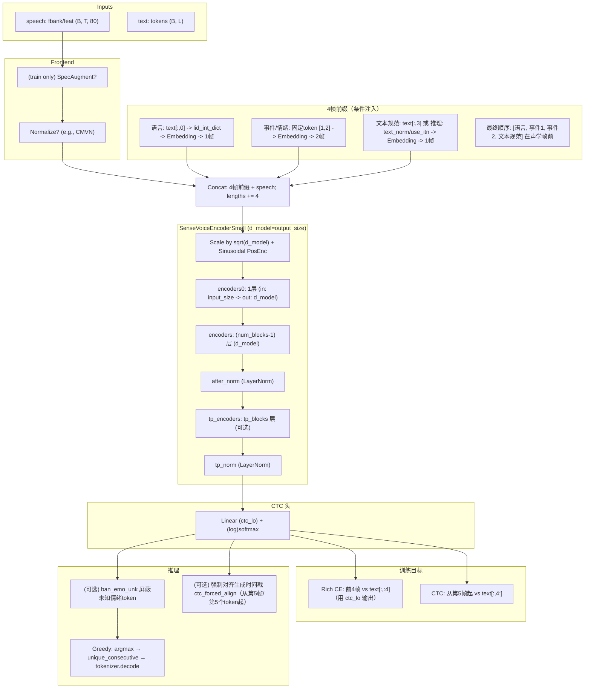
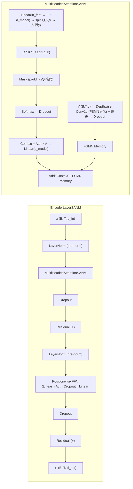

## 数据集

这些数据集体量大，标签通常只是“Laughter”，你需要通过**能量（Energy）\**或\**持续时间**进行二次筛选才能得到“开怀大笑”。

| 数据集名称                             | 描述与特点                                                   | 处理建议                                                     |                                                     |
| :------------------------------------- | :----------------------------------------------------------- | :----------------------------------------------------------- | --------------------------------------------------- |
| **AudioSet** (Google)                  | 世界上最大的音频事件数据集，包含大量 `Laughter`, `Giggle`, `Snicker` 等标签。 | 使用 `Laughter` 类，并结合音量/能量阈值筛选。还可以寻找子集 `Baby laughter` (通常很真诚) 或 `Belly laugh` (捧腹大笑)。 | https://huggingface.co/datasets/agkphysics/AudioSet |
| **Switchboard / ICSI Meeting Corpus**  | 经典的电话对话和会议录音数据集。包含大量社交笑声（Social Laughter）。 | 大部分是礼貌性笑声，但也有若干“爆笑”片段。通常会在转录中标注 `[Laughter]`。 |                                                     |
| **Audioset-Laughter (Gillick et al.)** | 从AudioSet中提取并在Interspeech 2021论文中清洗过的纯净笑声子集。 | 很好的预训练基底，可以在此基础上微调你的“开怀大笑”分类器。   |                                                     |

## TTS

|               |      |                                                        |
| ------------- | ---- | ------------------------------------------------------ |
| F5-TTS        | 上交 | https://github.com/SWivid/F5-TTS                       |
| Seed-TTS      | 字节 | https://bytedancespeech.github.io/seedtts_tech_report/ |
| **CosyVoice** | 阿里 | https://github.com/FunAudioLLM/CosyVoice               |
| ChatTTS       |      | https://github.com/2noise/ChatTTS                      |

## ASR

|            |      |                                                              |
| ---------- | ---- | ------------------------------------------------------------ |
| SenseVoice | 阿里 | https://github.com/FunAudioLLM/SenseVoice https://arxiv.org/pdf/2407.04051 |
|            |      |                                                              |
|            |      |                                                              |

https://huggingface.co/spaces/hf-audio/open_asr_leaderboard

## SenseVoice

### 总览图（训练/推理流程）

### 编码器与注意力细节（SANM 层）

- 关键说明
  - 前缀4帧顺序固定为：语言、事件1、事件2、文本规范；CTC 只对第5帧起的内容做识别损失。
  - Rich CE 用 CTC 头的线性层输出对前4帧进行分类监督，稳定“条件注入”学习。
  - SANM 将多头注意力与深度可分离卷积记忆（FSMN）相加，兼顾局部与长程依赖，友好流式。

https://www.gradio.app/guides/real-time-speech-recognition